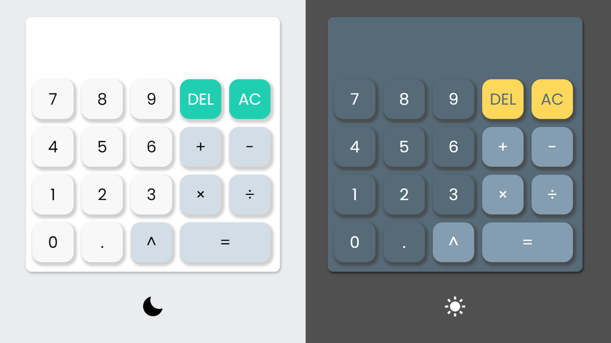

# 簡易網頁計算機 Simple Web Calculator

這是一個基礎的網頁計算機，使用HTML、CSS和JavaScript製作。這個計算機能夠執行簡單的數學運算，也可以調整淺／深色主題。\
This is a basic web calculator using HTML, CSS, and JavaScript. This calculator can perform simple arithmetic operations and can also adjust between light and dark themes.

## 功能 Features

- 加法 Addition
- 減法 Subtraction
- 乘法 Multiplication
- 除法 Division
- 指數 Exponentiation

## 截圖 Screenshot
